# NxFileViewer v4

Browse and verify Nintendo Switch packages with a Windows desktop interface based on [LibHac](https://github.com/Thealexbarney/LibHac).

Download application ZIPs from [GitHub Releases](https://github.com/sandmaennchen5/fork_NxFileViewer/releases). Choose x64 or x86, either standard (requires .NET 8 Desktop Runtime) or self-contained (includes .NET, compressed). Application updates preserve the installed architecture and runtime variant; firmware hash references are a separate optional download. See the [changelog](CHANGELOG.md) for release history.

## Workspace

Start, File check, Batch check, Renaming, NAND, Settings, Log and Info share one main window. Switching tabs retains results and settings drafts. During a background task, navigation is restricted to the active page and Log. Use Cancel to stop the task, including an unfinished single-file load.

Start offers a NAND shortcut and buttons to open installed plugin GUIs. The update notice lists only components with available updates.

The interface supports English, French, German and Spanish, with light, dark and system themes. The first launch starts maximized; saved window placement is respected when enabled. Info lists application details and keyboard shortcuts.

## File check

- Open NSP, NSZ, XCI, XCZ or standalone NCA files, including supported packages inside ZIP/7z archives. Separate file-dialog filters cover game packages, archives, NCA content and NAND images/split dumps.
- Browse the content tree, export files, and save or copy title images.
- View package metadata, languages, firmware requirements, required master keys, compression and security information. Tooltips explain structure, NCA signature results and permission levels; ACID signatures are displayed separately.
- Verify NCA hashes and signatures, compress/decompress supported packages, or open the selected title website from the file toolbar.
- Browse Super NSP/XCI packages and compressed NACP titles with extended language support.
- See missing-key warnings separately from informational messages about unused keys or permitted missing delta fragments.

The built-in solid NCZ reader caches a decoded prefix under `Temp/NCZ` to avoid repeated full decompression on backward reads. The first forward skip still requires decoding the preceding data, and temporary disk usage can approach the payload size. Block NCZ files use bounded block reads and indexed lookup. ZstdSharp.Port remains at 0.8.8. See [NCZ reader notes](docs/NSZ-reader-update.md).

## Homebrew and Switch SD cards

NRO files can be opened individually, in ZIP/7z archives and in batch checks. The overview reads embedded NACP title names, author/publisher, display version, languages, build ID and icon. Embedded assets are optional; NRO files do not need keys and do not receive NCA signature or integrity verification.

Use **Open SD card** in File check to select the SD root, `Nintendo` or `Nintendo/Contents`. Batch check also recognizes these folders. Registered NAX0 contents are opened read-only using `sd_seed` and the SD content keys derived from the current `prod.keys`; a separate `console.keys` file is not needed. The seed must belong to the source console. Keep the original `Nintendo/Contents/registered/...` paths, which are part of NAX0 encryption. Opening an individual NAX0 file within that tree opens its containing SD content set.

SD discovery includes the original `/Nintendo` directory, RAW emuMMC under `/emuMMC/RAW1/Nintendo` through `RAW3`, and file emuMMC under `/emuMMC/SD00/Nintendo` through `SD99`. Select the SD root, `emuMMC`, an individual slot, or its Nintendo/Contents folder. File check offers a selector for the discovered content sets and initially opens the first available set (original Nintendo first). Batch creates a separate NAX0 row per discovered content set, even with recursive scanning disabled. Each source requires its matching seed in the active `prod.keys`.

FAT32 split NCA directories (`00`, `01`, ...) are supported even when copied folders lost their archive attribute. The content tree and title selector expose the installed titles; control metadata without a corresponding Meta NCA is displayed separately. NRO and NAX0 have dedicated batch filters; SD contents cannot be renamed or converted through package actions.

## Batch check

Choose a directory or ZIP/7z archive. Subdirectories and archives can be included or excluded.

- **Read file list** scans package metadata without running game-package integrity checks.
- **Read file list and verify integrity** combines scanning and verification.
- **Verify integrity of all files** checks the scanned list later, including rows hidden by filters.
- Firmware candidates are identified and verified during scanning.
- Successfully verified physical packages can be compressed, decompressed or moved; relative subdirectories are preserved.
- Right-click a row for individual actions: open in File check, verify, convert, move, open the title website, check naming or rename.

The Columns button shows or hides additional overview fields. Click headers to sort, Shift-click for multiple sort columns, and drag headers to reorder. Combine search, file-type, integrity and naming-status filters with Only errors. Naming filters include matching, differing, unchecked and failed names. The naming actions appear immediately before Cancel. CSV export follows the current filtering and sorting and includes all overview fields. Hover over cells or headers to read their full text. Horizontal/vertical scrolling and Shift + mouse wheel support wide tables. Overview metadata is retained for quick selection without reopening NSZ files.

While reading files, the overview follows the current game package and selects its completed result. The last five batch sessions can be displayed or resumed. Saved game metadata fills the historical overview even when the source or archive is unavailable. Disable history under Settings → Program if desired; existing saved sessions remain available when re-enabled. See [batch history](docs/Batch-history.md).

## Renaming

Configure naming patterns under **Settings → Naming settings**; the Renaming page links to these settings. Pattern and character-replacement sections remain visible.

An optional target directory changes the destination root. Without one, each file's current directory is used. Patterns support relative subdirectories, such as `DLC/{WTitle}.{Ext:L}` or `{WAppTitle}/DLC/{WTitle}.{Ext:L}`. Use the target-directory field for absolute paths; absolute paths and `..` are rejected inside patterns. See [naming patterns and batch naming](docs/Renaming.md).

The result table shows old path, new path, status and errors. Paths use `QUELL::` for the source root and `ZIEL::` for a different destination root; these display markers are retained across interface languages. Simulation creates no folders or files. Actual renaming creates missing destination folders and never overwrites an existing target. Online title failures fall back to local NACP names when available.

In Batch check, Check naming compares physical NSP/NSZ/XCI/XCZ packages with the saved patterns and target directory. Naming columns appear at the end of the table; additional proposed-path/error columns can be enabled. The context-menu check shows a result dialog. Individual renaming previews the paths and requires Yes or Cancel confirmation. Rename all differing files checks eligible rows again against current settings. Firmware and archive members are excluded; naming checks are independent of integrity verification.

## Keys and title sources

The expandable prod.keys and title.keys sections show independent paths and validation results for the program directory, %USERPROFILE%/.switch and the custom path when configured. The currently used file is marked; each location has a button to open its file location, replacing the duplicate effective-path section. Results refresh when opening the sections, reloading keys, copying shared keys or changing the custom path. Validation includes structural errors, missing master-key revisions and firmware estimates. Select your own locations or use configured download URLs, including anonymous FTP. A shared IP/hostname field replaces {IP} in both URL templates, for example ftp://{IP}:5000/sdmc:/switch/prod.keys. Download keys beside Copy keys downloads prod.keys and title.keys to their configured custom paths, or to the program directory when a custom path is empty. Failed or cancelled downloads retain existing files; successful downloads refresh validation. Legacy FTP URLs sharing one host migrate to the shared field without changing their ports or remote paths. Reload keys reruns discovery and validation: an explicit settings path takes priority, followed by the program directory and then %USERPROFILE%/.switch. Newly added program-local files are recognized without restarting. Missing required keys are shown on Start and file/batch views.

An explicit settings action copies the current key files to `%USERPROFILE%/.switch` for other applications. Existing files require replacement confirmation; source files remain unchanged. Key values are masked in saved session logs.

Title-name providers are Tinfoil, GitHub TitleDB, NLib API and Custom. The title website is selected independently from Tinfoil, NX Content or Custom. Presets have fixed URLs; only Custom displays an editable template. See [title providers](docs/Title-providers.md).

## Archives and firmware

ZIP and 7z archives are supported in individual and batch mode, including nested archives up to eight levels. Virtual paths identify the chain, for example `outer.zip::inner.zip::Game.nsp`. Opening an archive extracts all its contents into a shared session under `Temp/ZIP`; nested archives are extracted when processed. Allow enough disk space for the extracted contents. Switching between already loaded entries reuses their files and models. Closing or reopening the archive releases its retained temporary data.

Mixed archives can contain game packages, firmware archives and firmware folders. Firmware sets appear as separate entries and are checked independently; missing reference data does not hide them. Batch file types indicate archive origin, such as `NSP (ZIP)`. Archive members cannot be converted, moved or renamed through package actions.

Firmware verification checks NCA sizes and SHA-256 hashes, identifies the best matching firmware version, and reports missing, changed, additional, duplicate or incorrectly named files. Individual firmware NCAs list matching releases by content hash. Sources are never renamed by firmware verification.

References are fetched from GitHub into memory only when firmware candidates are detected or explicitly opened. Each check fetches current references; ordinary game folders make no firmware-reference request. Optional local `fw/hashes/*.json` files provide an offline fallback. Extract the separate firmware-hashes ZIP beside `NxFileViewer.exe` to install them. See [firmware verification](docs/Firmware-verification.md) and [reference maintenance](fw/README.md).

## NAND plugin

NAND dumps are recognized in **File check**, **Batch check** and ZIP/7z archives, including split dumps. The individual NAND details view and **NAND** workspace provide information and partition export through an optional NxNandManager CLI installation. Install/update it under **Settings → Updates → Plugins → NxNandManager**, with rollback to the previous version. The plugin uses the viewer's active prod.keys when it contains BIS keys. Settings → Plugins accepts a custom EXE override and an optional separate BIS key file. Exports preserve stored encryption and write only to new files; detected NANDs remain Unchecked in batch results. See [NAND plugin setup and limitations](docs/NAND-plugin.md).

## Plugin nicoboss/nsz

The separately installed [nicoboss/nsz](https://github.com/nicoboss/nsz) plugin converts physical NSP/XCI and NSZ/XCZ packages. It uses the viewer's current `prod.keys`. Settings → Plugins → nicoboss/nsz provides compression level, Automatic/Solid/Block mode, block size and a custom executable option. Installation, updates and rollback are under **Settings → Updates → Plugins → nicoboss/nsz**.

Conversion verifies both source and output. Existing targets offer replacement, numbering or cancellation. Optional source deletion occurs only after successful conversion and verification. Progress distinguishes source verification, conversion and output verification, with CLI percentage/speed/ETA when available. Verified downloads survive failed startup checks and are reused; the official GUI package can provide CLI mode for the recognized standalone Python-runtime failure. Temporary ASCII aliases avoid Unicode filename failures in bundled executables. See [plugin setup and conversion](docs/NSZ-plugin.md).

## Updates and local storage

The central update check compares NxFileViewer, installed managed plugins, regional/fallback TitleDB catalogs and firmware hash references; results appear once in Settings. Custom plugin executables cannot be version-checked automatically.

Settings → Updates groups application updates, plugin installation/update/rollback, TitleDB refresh and firmware-reference actions. It shows the local TitleDB refresh date for each regional catalog and the highest firmware version covered by installed hash references. Online firmware checks also show the highest available reference version. Automatic application checks are optional and never install without confirmation. Published pre-releases can be included explicitly. Updates verify SHA-256, version and architecture before replacement and restart. See [application updates and compatible release packages](docs/Application-updates.md).

Check online hashes reads firmware references without saving them; Update offline hashes explicitly replaces the local set and retains a backup.

Settings, Plugins, Cache, Temp, History, Logs and Updates are stored beside the executable. The program directory must be writable; there is no AppData import or storage fallback.

Each launch creates a UTF-8 log in `Logs`, with timestamps and severity at the selected logging level. Settings → Program controls retention from 1 to 100 launches (default 5). Older session logs are removed after settings load and when a smaller retention count is applied. Logs are flushed immediately and key values are redacted. The Log tab follows new messages automatically.

## Requirements and development

Windows and the [.NET Desktop Runtime 8](https://dotnet.microsoft.com/download/dotnet/8.0) are required if the downloaded application does not start. Development requires the .NET 8 SDK and optionally Visual Studio 2022 or later.

```powershell
dotnet restore src/NxFileViewer.sln
dotnet build src/NxFileViewer.sln -c Release --no-restore
dotnet test src/NxFileViewer.sln -c Release --no-restore
.\Publish.ps1
```

Publish.ps1 creates x64/x86 application ZIPs and a separate optional firmware-hashes ZIP. The Build workflow exposes these as separate artifacts retained for seven days; attach release ZIPs to GitHub Releases for permanent downloads and application updates. Source paths in Release diagnostics are mapped to `/_/NxFileViewer/`, with debug symbols embedded in the executable. Runtime file paths remain visible.

The ignored `/test/` directory contains personal test data; automated tests under `src/*.Test` are part of the repository.

## Screenshots

Screenshots illustrate the viewer and may show an earlier interface.

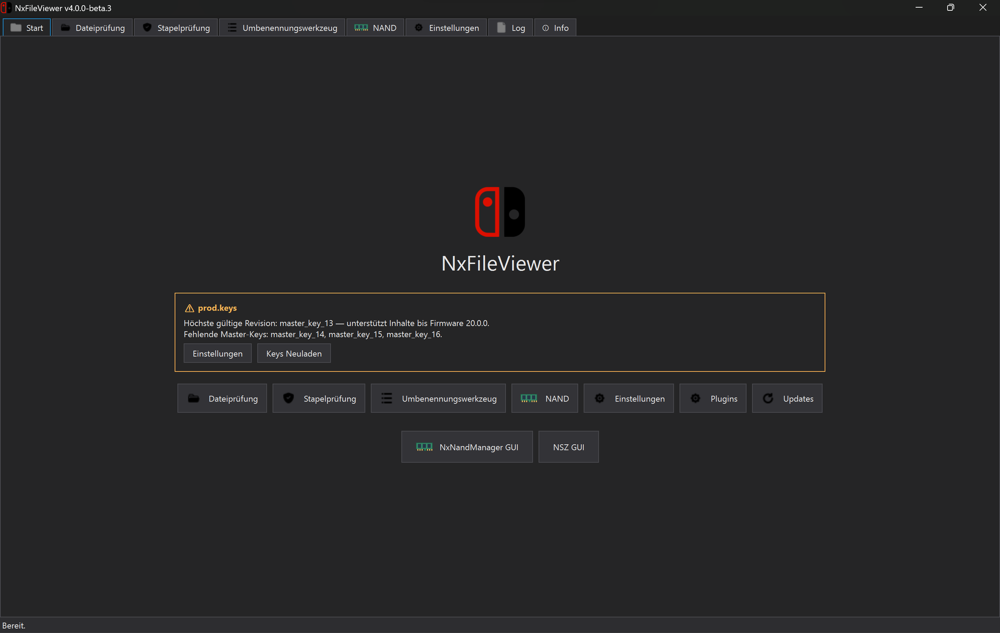
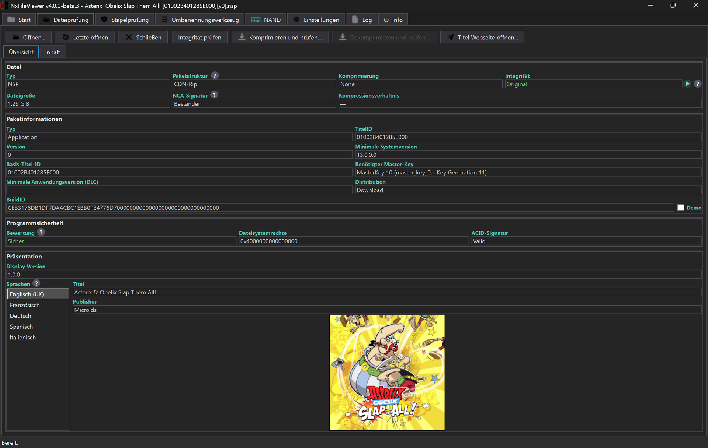
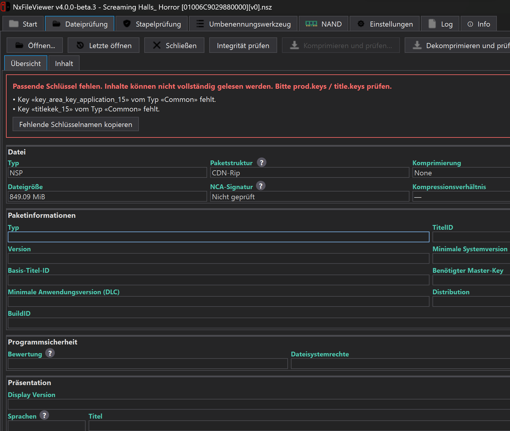
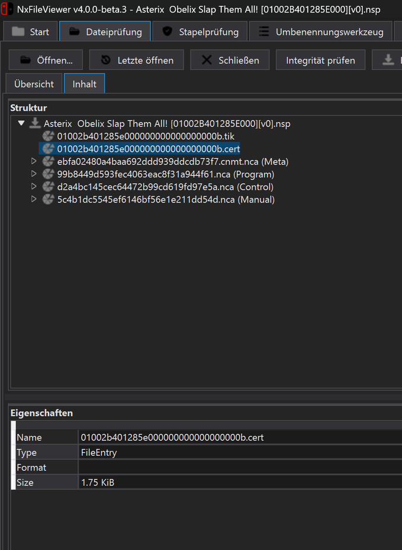
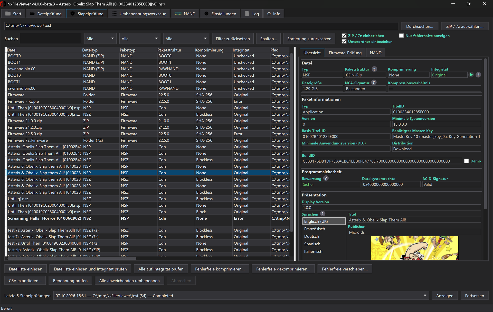
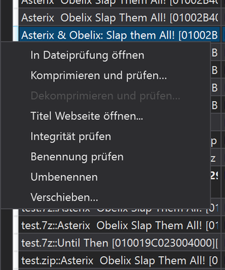
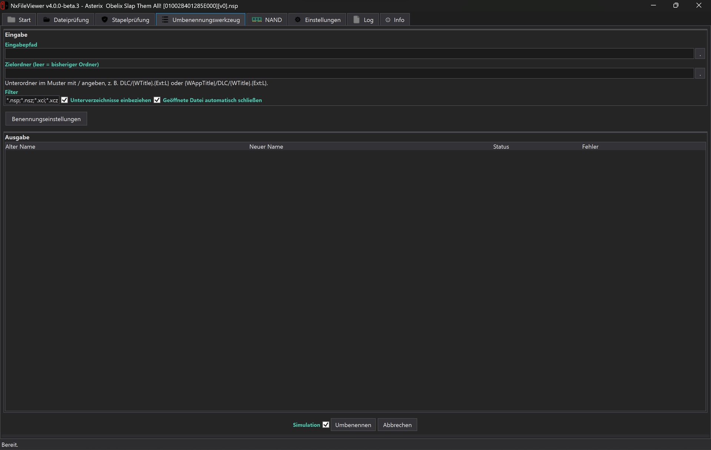
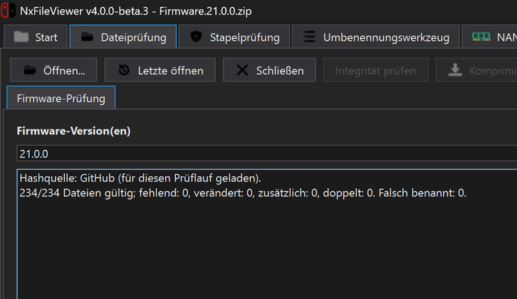
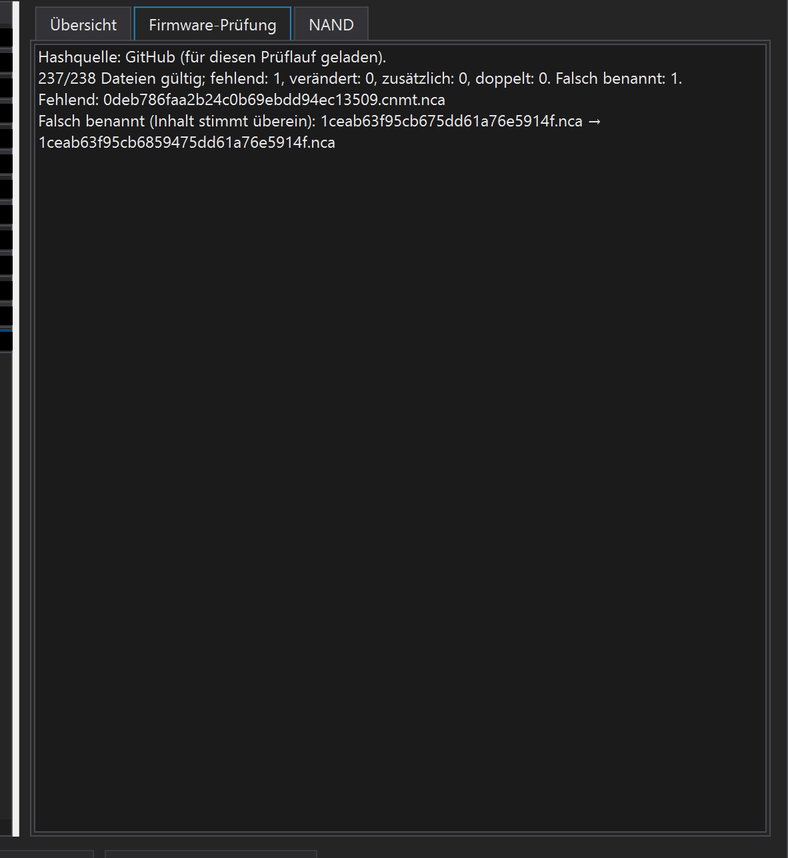
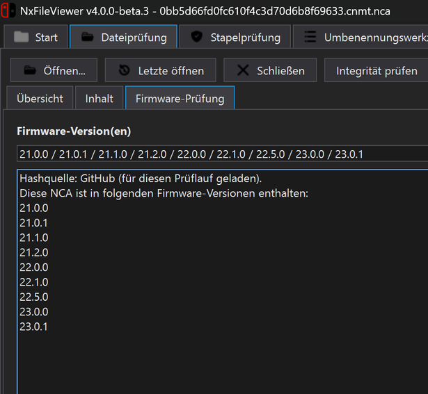
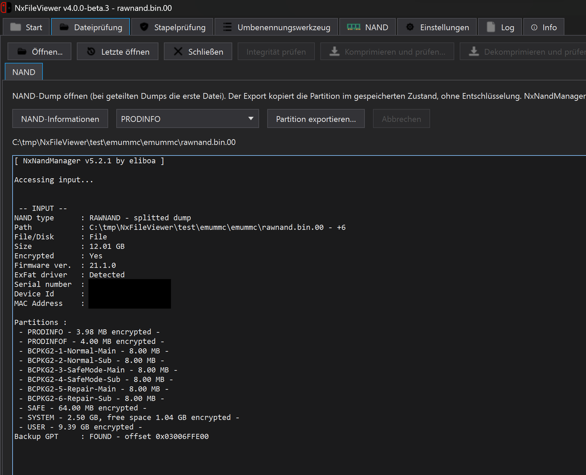
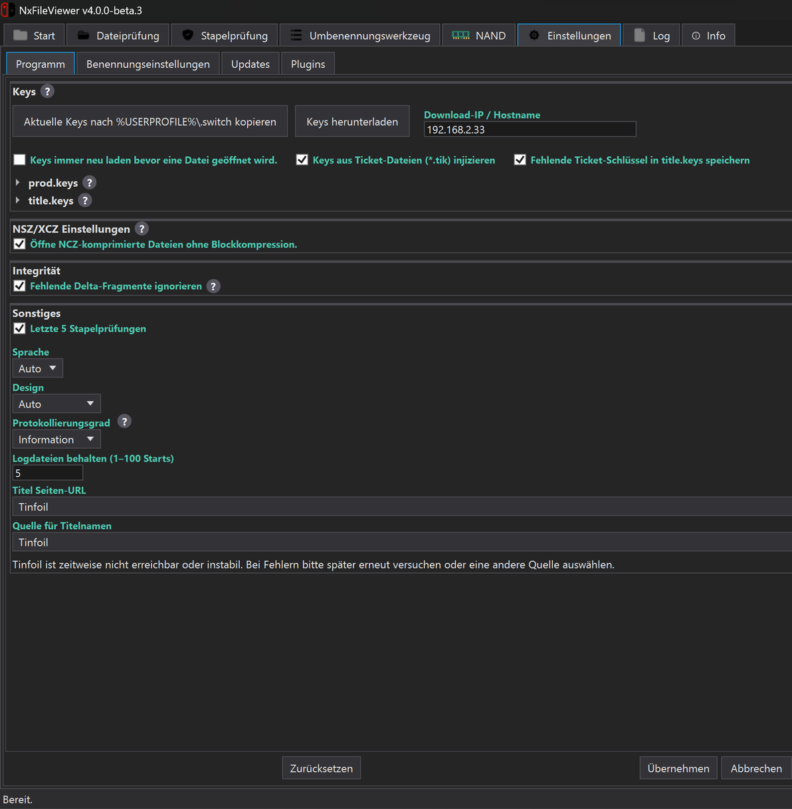
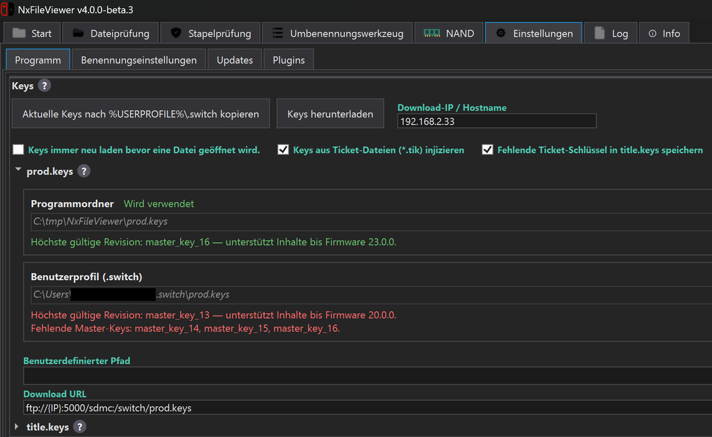
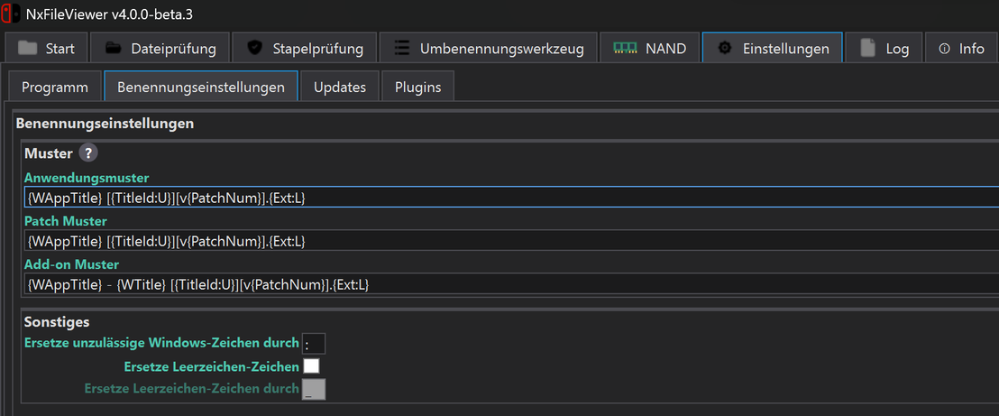
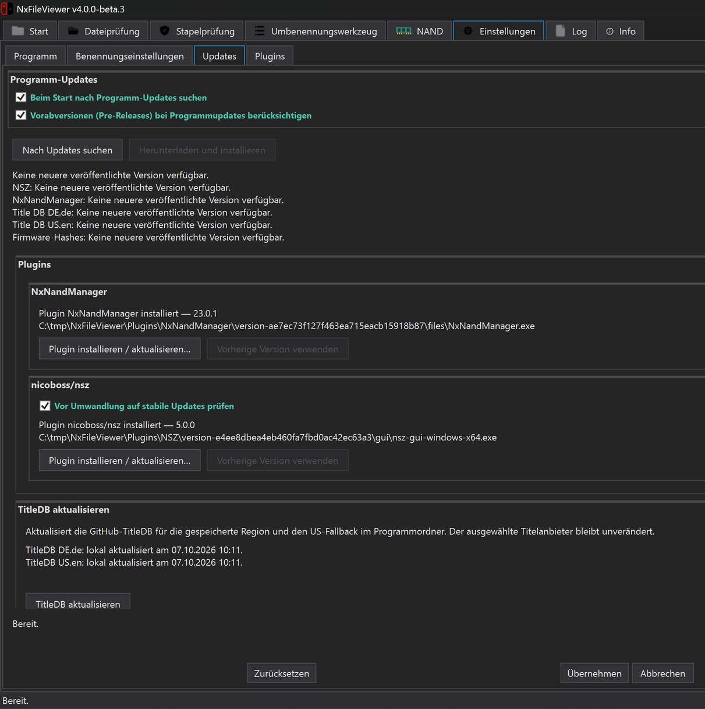
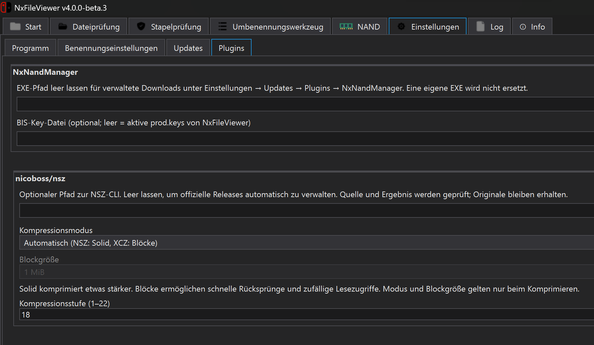

## Contributing and credits

Contributions and translations are welcome.

Thanks to [Myster-Tee](https://github.com/Myster-Tee/NxFileViewer)

Thanks to [Thealexbarney](https://github.com/Thealexbarney) for LibHac, [eliboa](https://github.com/elibo) and [THZoria](https://github.com/THZoria) for NxNandManager, [nicoboss](https://github.com/nicoboss) for NSZ and format guidance, and the Nintendo Switch community.
